# EasyLeave

**EasyLeave** is a web-based Leave Management System designed to streamline the process of applying for, approving, and tracking employee leaves within an organization. Built with Java (Servlet/JSP) and following a classic web architecture, EasyLeave provides a simple interface for both employees and administrators to manage leave requests efficiently.

---

## 🌟 Features

- **Employee Registration & Login:**  
  Employees can sign up and log in to the system.
- **Leave Application:**  
  Employees can submit leave requests online.
- **Admin Panel:**  
  Administrators can view, approve, or reject leave requests.
- **Leave Status Tracking:**  
  Employees can check the status of their leave applications.
- **Invalid User Handling:**  
  Users are notified if login credentials are incorrect.
- **Success Notifications:**  
  Users receive feedback on successful actions.

---

## 🖼️ Demo Images

Below are screenshots of EasyLeave in action, showcasing the main features and user interface:

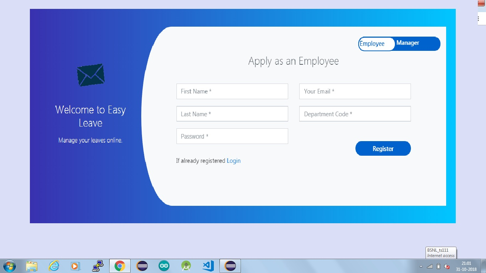
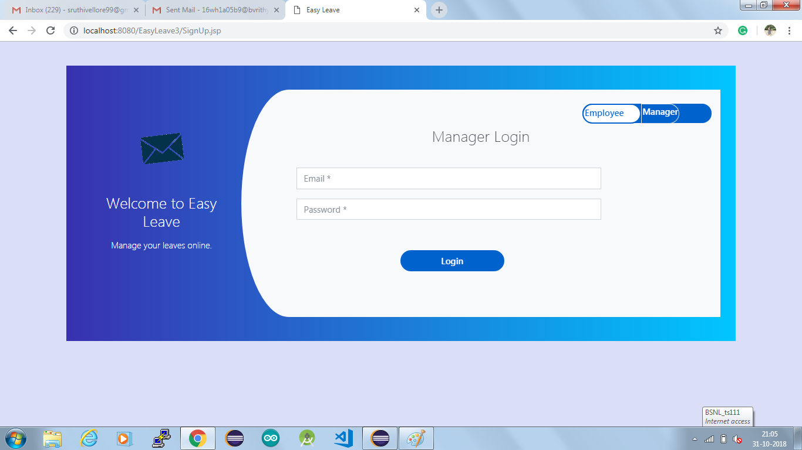
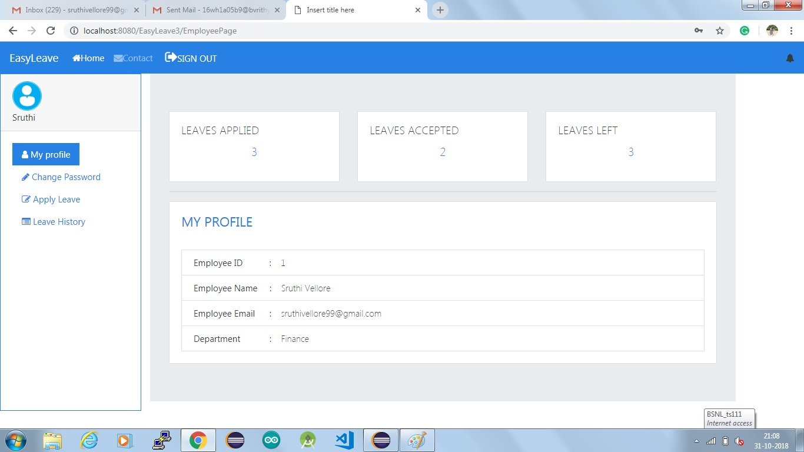
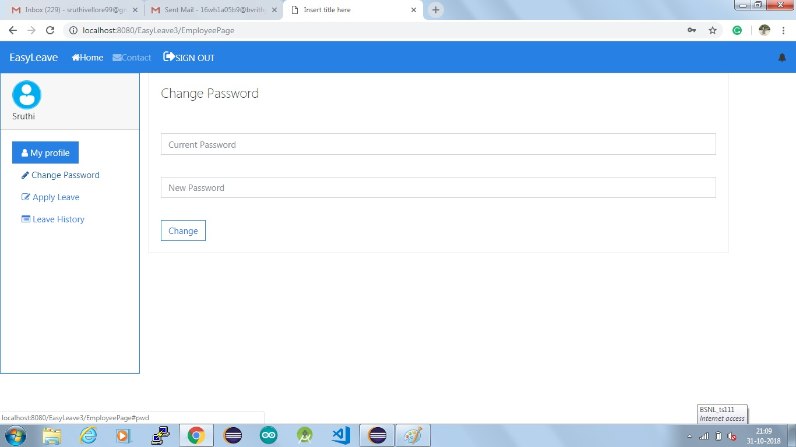
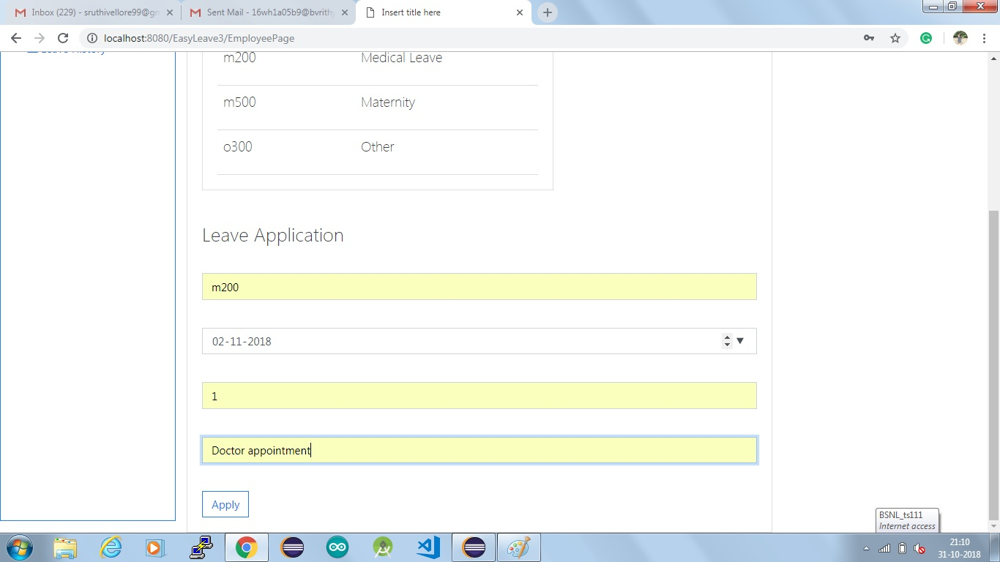
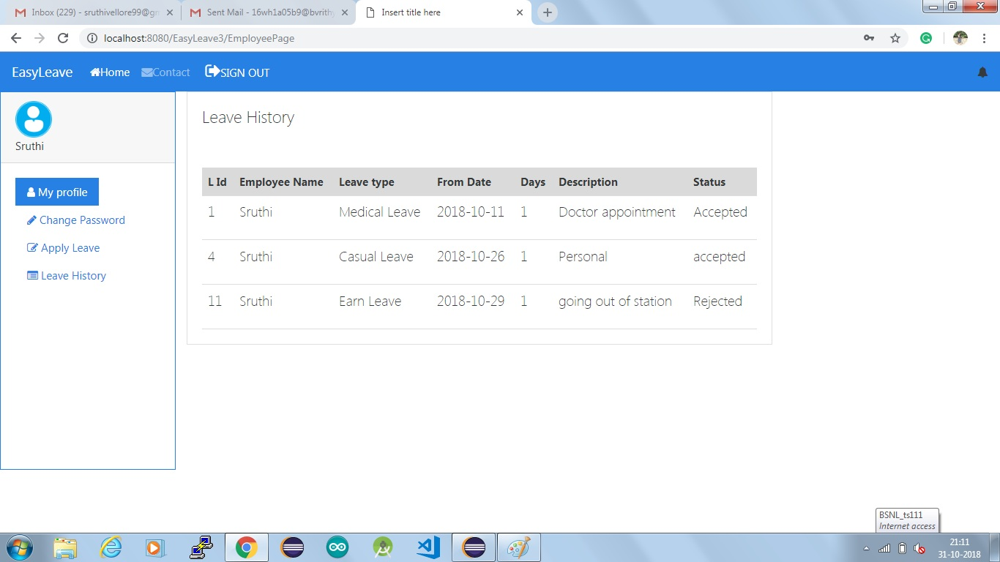
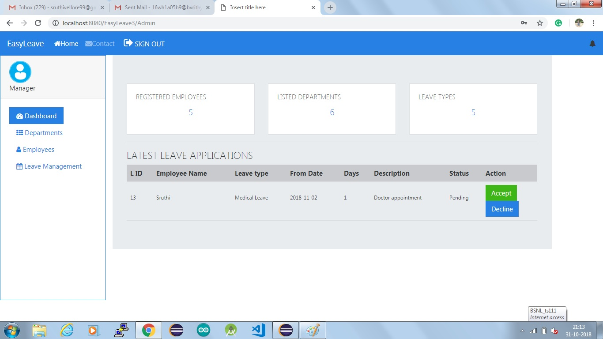
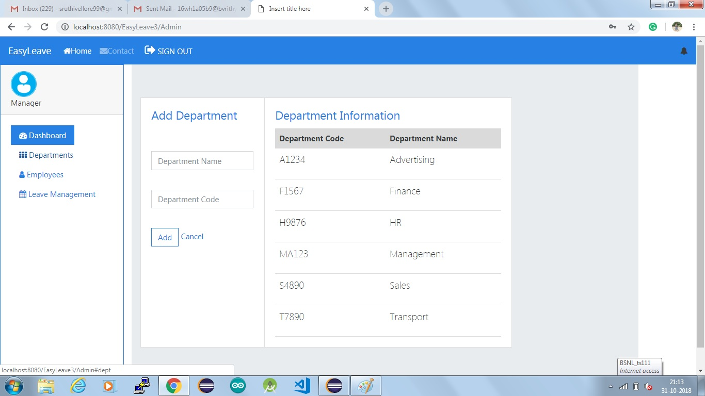
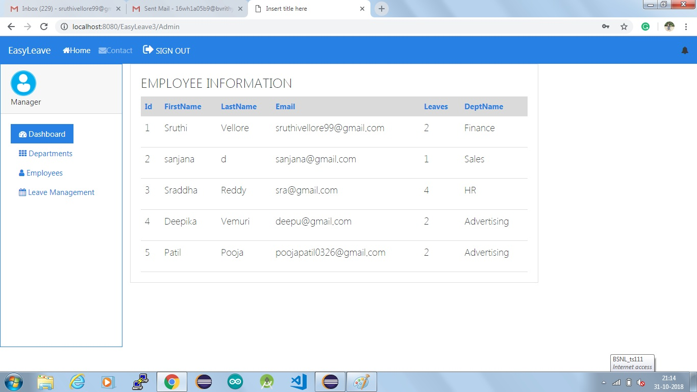
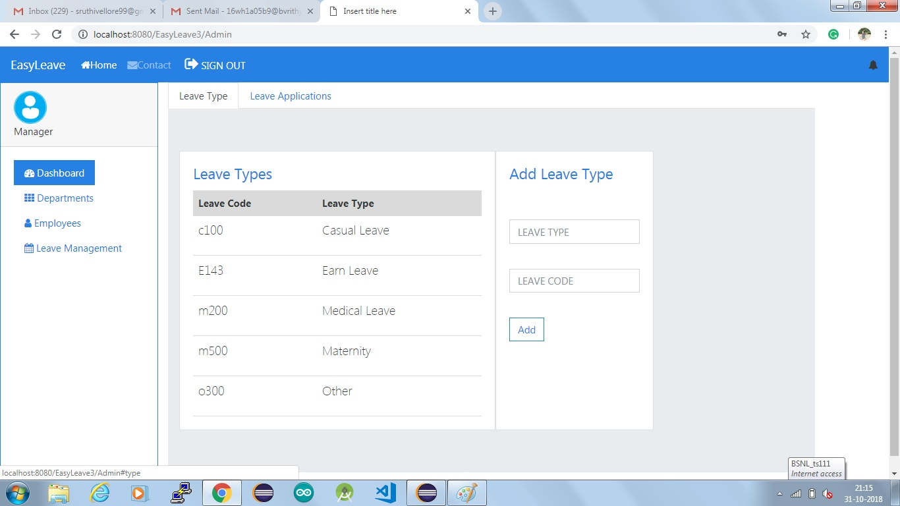
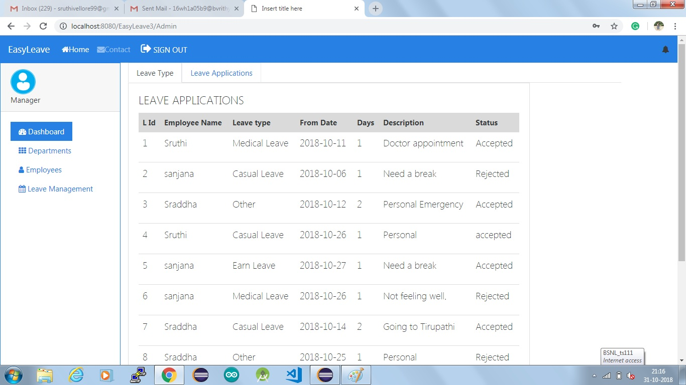

---

## 🗂️ Project Structure

```
EasyLeave/
├── META-INF/
├── WEB-INF/
├── demo-images/
│   ├── 1.png
│   ├── 2.png
│   ├── 3.png
│   ├── 4.png
│   └── 5.png
├── images/
├── EasyLeave.war
├── EasyleaveEER.mwb
├── Envelope.gif
├── InvalidUser.jsp
├── SignUp.jsp
├── Success.jsp
├── admin.jsp
├── employee.jsp
└── ...
```

- **META-INF, WEB-INF:** Standard Java web application folders.
- **demo-images/:** Contains screenshots of the application.
- **images/:** Contains general image assets.
- **.jsp files:** Core web pages for user interaction (sign up, login, dashboards, etc.).
- **EasyLeave.war:** Deployable WAR file for Java web servers.
- **EasyleaveEER.mwb:** MySQL Workbench file for the database schema.

---

## 🚀 Getting Started

### Prerequisites

- Java Development Kit (JDK)
- Apache Tomcat or any compatible Java web server
- MySQL (for database)
- MySQL Workbench (optional, for viewing/modifying the EER diagram)

### Setup Instructions

1. **Clone the repository:**
   ```bash
   git clone https://github.com/sruthivellore/EasyLeave.git
   ```
2. **Database Setup:**
   - Use `EasyleaveEER.mwb` to create the required database schema in MySQL.
3. **Deploy the Application:**
   - Deploy `EasyLeave.war` to your Java web server (e.g., Tomcat).
4. **Access the App:**
   - Open your browser and navigate to the server URL (e.g., `http://localhost:8080/EasyLeave`).

---

## 👨‍💼 User Roles

- **Employee:**  
  Can sign up, log in, apply for leave, and view leave status.
- **Admin:**  
  Can log in, view all leave requests, approve or reject them.

---

## 👩‍💻 Author

Developed by [sruthivellore](https://github.com/sruthivellore).

---
